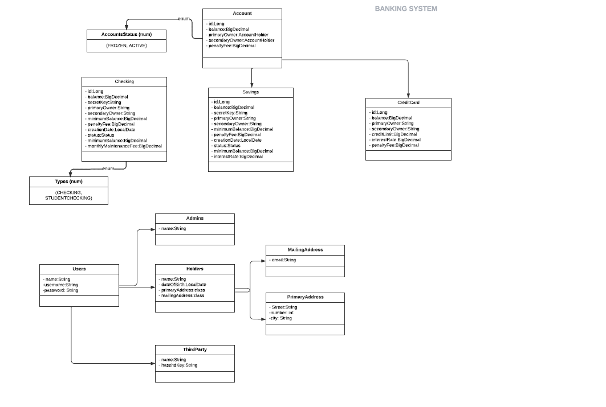

# API-REST-Bank

Sistema bancario. 

Las principales funciones son las siguientes: 

Las personas con rol admin puede realizar las siguientes acciones:

- Crear un holder
- Crear una cuenta
- Modificar dicha cuenta
- Eliminar tanto el holder como la cuenta 

Las personas con rol holder pueden:

- Ver su balance
- Modificar su dirección
- Añadir transacciones entre cuentas 
- Ver sus transacciones

Las personas con rol third party pueden:

- Realizar transacciones con las cuentas
- Ver las trasacciones que ha realizado

Creada con:

-Java 8
-Spring Boot
- Testada con Junit.
